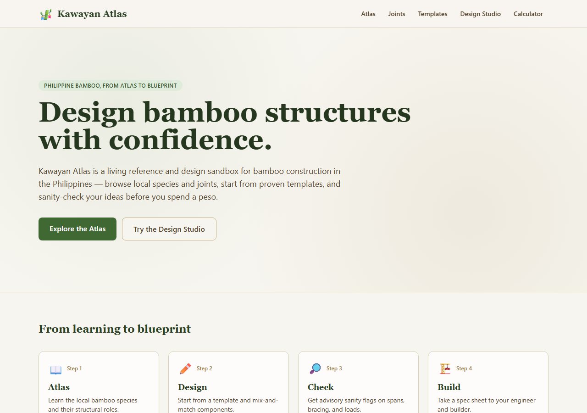
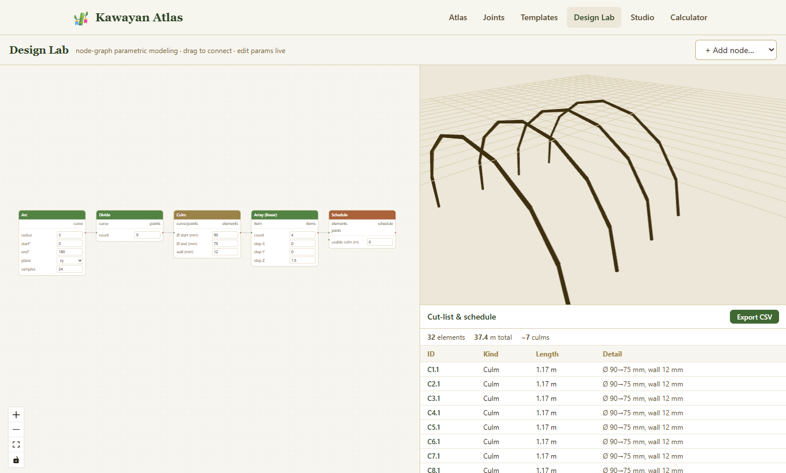
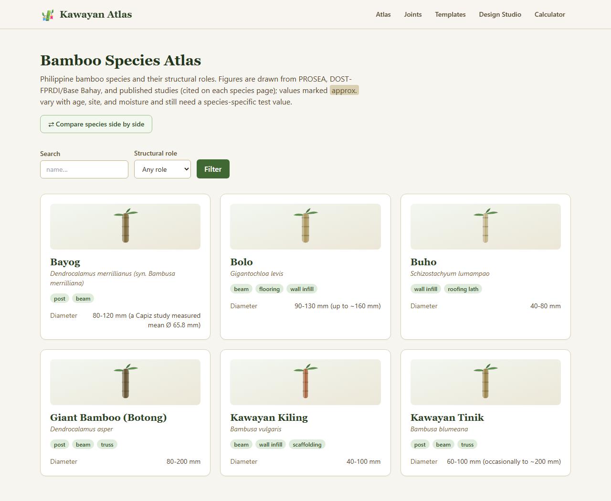
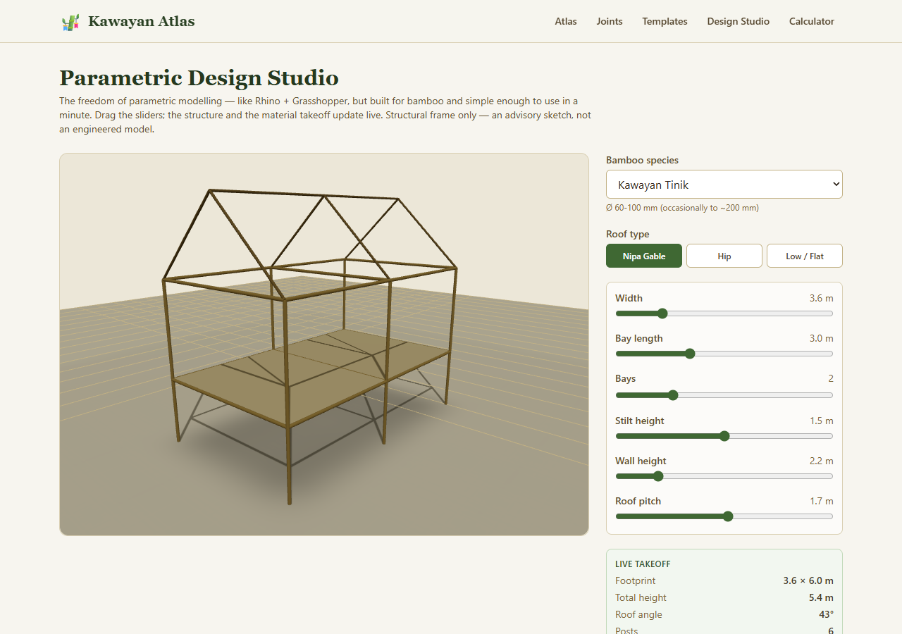
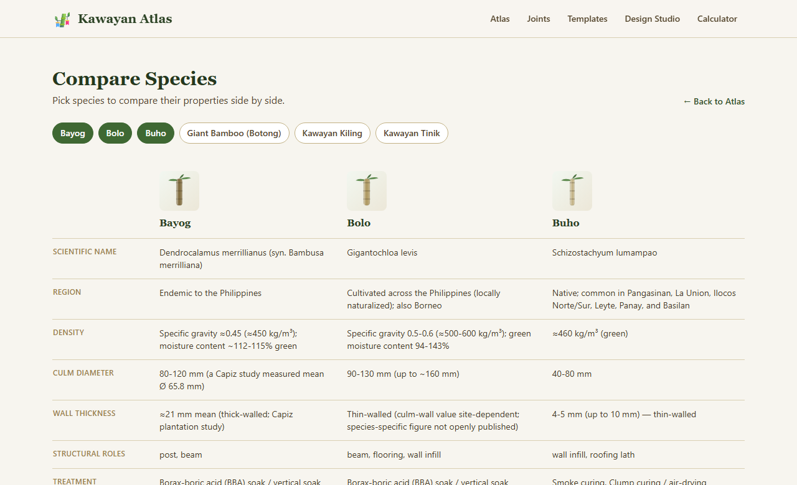
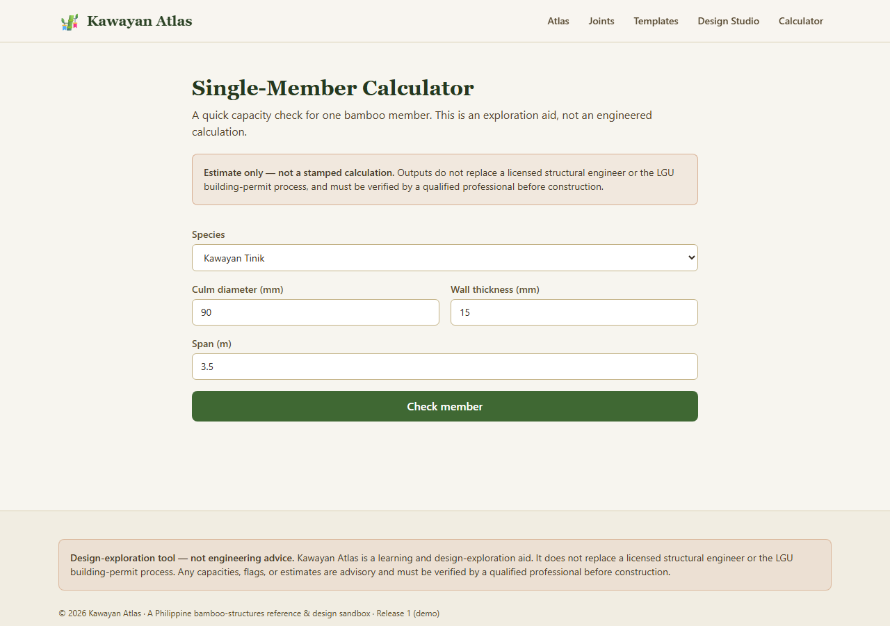

# 🎋 Kawayan Atlas

**A Philippine reference and design sandbox for bamboo construction** — a browsable
species atlas, a joint/connection library, a template gallery, an interactive 3D design
studio, and a (safety-gated) structural calculator, in front of an aesthetic landing page.



> **Design-exploration tool — not engineering advice.** Kawayan Atlas helps you learn about
> and explore bamboo structures. It does **not** replace a licensed structural engineer or
> the LGU building-permit process. Every structural output is advisory, gated behind
> engineer review, and numeric facts are cited to their sources.

This repository is **Release 1**: a full-stack demo with **no login**, designed to run
entirely on free tiers. See [`PLAN.md`](PLAN.md) for the full product & build plan and
[`DEPLOYMENT.md`](DEPLOYMENT.md) for the $0 deployment guide.

---

## Features

### 🧩 Design Lab — browser node-graph platform
A Grasshopper-style computational design tool built specifically for bamboo, in the
browser — no install, no plugins. A **node-graph canvas** drives a **live 3D view** and a
**fabrication cut-list**. It's built on the whitepaper's architecture, in dependency order:

- **Geometry kernel** — primitives and operations (line, arc, grid, divide, transform, array, loft/sweep)
- **Node-graph evaluation engine** — dependency-ordered, live re-evaluation on any change
- **Bamboo-aware nodes** — `culm` (tapered tube along a curve), `strip` (flat ribbon), `joint`, `bundle`
- **Fabrication output** — a `schedule` node produces a per-element cut-list (lengths, diameters, cut angles) exportable as **CSV**

The proof chain `arc → divide → culm → array → schedule` ships preloaded, rendering a
bamboo barrel-vault whose every parameter is live-editable.



### 📖 Bamboo Species Atlas
Six Philippine bamboo species with **verified, cited** properties (density, culm diameter,
wall thickness, structural roles, treatment) — every figure sourced to PROSEA, DOST-FPRDI /
Base Bahay, or published studies. Filter by role, search, and **compare species side by side**.



### 🧱 Parametric Design Studio
The freedom of parametric modelling — like Rhino + Grasshopper, but built for bamboo and
simple enough to use in a minute (no node graph, no plugins, no learning curve). Drive
continuous sliders — **width, bay length, bay count, stilt height, wall height, roof
pitch** — plus **species**, **roof type**, **bracing** (knee / cross), and a **door
opening**, and the `react-three-fiber` model reshapes live. A real-time **material takeoff** (footprint, roof angle, total culm length, estimated
culms) updates as you drag, and any design can be **saved & shared** via a link (anonymous,
no account).



### ⇄ Compare Species
Pick any species and see their properties side by side.



### 🔎 Safety-Gated Calculator
A single-member capacity check whose numeric rules stay **disabled until a licensed
engineer signs off** — so no capacity figures are shown, only the honest disclaimer.



Plus: a **joint & connection library** (traditional lashings to bolted mortar-plug joints,
cited to ISO 22156 and Base Bahay), a **template gallery** with bills of materials, a
responsive mobile nav, custom 404 / error pages, and SEO (dynamic metadata, sitemap,
`robots.txt`, and a branded OpenGraph image).

---

## Tech stack

| Layer | Choice |
|---|---|
| **Frontend** | Next.js 14 (App Router) · TypeScript · Tailwind CSS · react-three-fiber |
| **Backend** | Python · FastAPI · SQLAlchemy · Alembic |
| **Database** | SQLite (local dev) → PostgreSQL / Neon (deployment) — one `DATABASE_URL` swap |
| **Tests / CI** | pytest · GitHub Actions (backend tests + frontend type-check & build) |
| **Hosting** | Azure Static Web Apps / Vercel (frontend) · Azure Container Apps (backend) · Neon (DB) — all free tier |

The frontend fetches all content from the backend REST API (server-rendered), so it's a
genuine full-stack app rather than a static site — while still deployable for $0.

---

## Project structure

```
kawayan-atlas/
├── backend/                 # FastAPI + SQLAlchemy
│   ├── app/
│   │   ├── main.py          # app + routers + CORS
│   │   ├── models.py        # SQLAlchemy models (schema)
│   │   ├── schemas.py       # Pydantic request/response
│   │   ├── routers/         # species, joints, templates, designs, calculator
│   │   ├── seed_data/       # cited JSON content (species, joints, templates)
│   │   └── seed.py          # idempotent seeder
│   ├── alembic/             # database migrations
│   └── tests/               # pytest API suite
├── frontend/                # Next.js app
│   └── src/
│       ├── app/             # routes (atlas, joints, templates, studio, compare, calculator)
│       ├── components/      # header, footer, glyphs, 3D studio, sources
│       └── lib/             # typed API client
├── docs/screenshots/        # images used in this README
├── PLAN.md                  # product & build plan
└── DEPLOYMENT.md            # free-tier deployment guide
```

---

## Run it locally

Requires Python 3.12+ and Node 20+.

### 1. Backend (from `backend/`)

```bash
python -m venv .venv
.venv/Scripts/python.exe -m pip install -r requirements.txt   # Windows
# source .venv/bin/activate && pip install -r requirements.txt  # macOS/Linux

# create the schema — quick (create_all runs on startup) or via migrations:
alembic upgrade head

# seed the database (idempotent)
python -m app.seed

# run the API on http://127.0.0.1:8020
python -m uvicorn app.main:app --reload --port 8020
```

Interactive API docs: http://127.0.0.1:8020/docs

### 2. Frontend (from `frontend/`)

```bash
npm install
npm run dev   # http://localhost:3000
```

The frontend defaults to the API at `http://127.0.0.1:8020`. To point elsewhere, copy
`.env.local.example` to `.env.local` and set `NEXT_PUBLIC_API_URL`.

---

## Testing & CI

```bash
# backend (13 API tests, isolated temp database)
cd backend && .venv/Scripts/python.exe -m pytest -q

# frontend type-check + build
cd frontend && npx tsc --noEmit && npm run build
```

[`.github/workflows/ci.yml`](.github/workflows/ci.yml) runs the backend tests plus the
frontend type-check and build on every push / PR (assumes `kawayan-atlas/` is the repo root).

---

## Data model

| Table | Purpose |
|---|---|
| `bamboo_species` | Species atlas content (properties, roles, sources) |
| `joint_types` | Joint/connection library |
| `templates` | Template gallery (components + bill of materials) |
| `designs` | Anonymous saved/shared designs (owner added in Release 2 with accounts) |

Content types map 1:1 to future database tables, and the calculator is a pure function —
so the Release 2 additions (accounts, community) are extensions, not a rewrite.

---

## Deploying

See [`DEPLOYMENT.md`](DEPLOYMENT.md) for the free-tier ($0) path: Neon Postgres + Azure
Container Apps (backend) + Azure Static Web Apps or Vercel (frontend).

---

## Sources

Species and joint data are cited on each detail page. Primary sources include
[PROSEA Bamboos](https://prosea-bamboos.linnaeus.naturalis.nl/),
[DOST-FPRDI](https://fprdi.dost.gov.ph/),
[Base Bahay Foundation](https://base-builds.com/) (Cement-Bamboo Frame Technology and the
ISO 22156 design manual), and [ISO 22156:2021](https://www.iso.org/standard/73831.html).
